# **Creating an empty project**

## augg.io

**Please use Unity 6 or newer.**

### Create project

1. Create an empty Unity project. When asked for the template choose 3D (URP).  
   ![Create an empty Unity project][image1]

2. In the top menu click **File** \-\> **Build Settings**. In the window select Android (iOS) and click "Switch platform".  
   ![ ][image2]

### Setup player settings (Android)

1. In the build settings window click on **"Player Settings"** in the left bottom corner.

2. Fill in the **company name** and **product name**.

3. Set **Auto Graphics API** to false

4. **Remove Vulkan** from the list and only keep **OpenGLES3**.

5. Disable **multithreaded rendering**.  
   ![ ][image3]

6. Set **Minimum API Level** to at least **24**

7. Make sure the scripting backend (under Configuration) is set to **IL2CPP**.  
   ![][image4]

### Setup player settings (iOS)

1. In the build settings window click on "Player Settings" in the left bottom corner.

2. Fill in the **company name** and **product name**.

3. Disable **multithreaded rendering**.

4. Set **bundle identifier**

5. Set **Target minimum iOS** version to **14.0**

6. Set Requires **ARKit Support** to 'true'

7. Fill in **Camera Usage Description** if not already filled in
   
   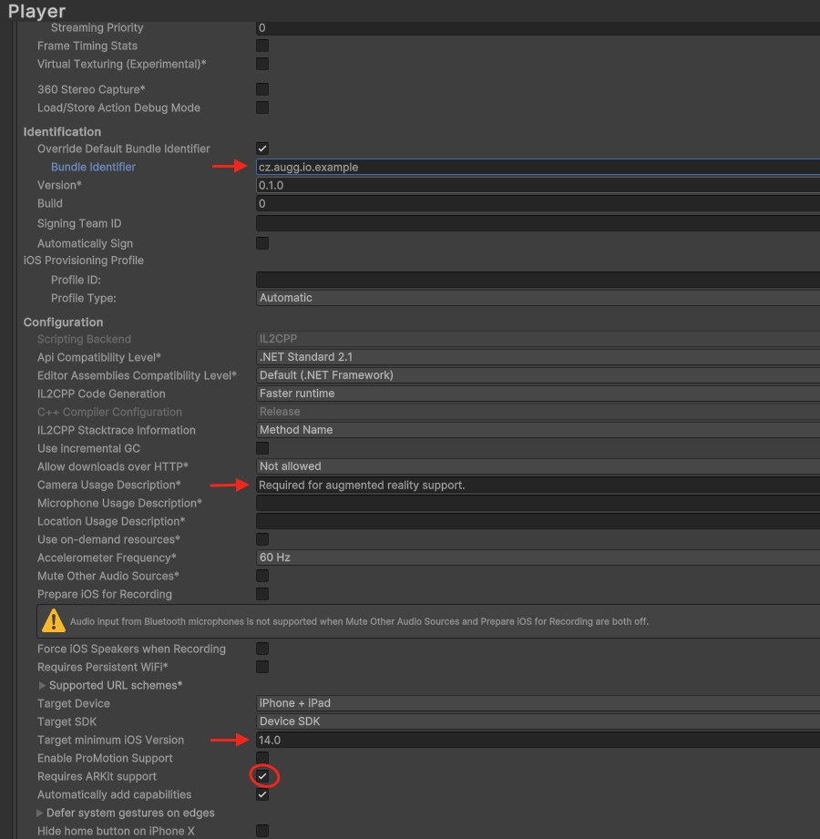

### Installing packages

1. In the top menu click on **Windows** \-\> **Package Manager**

2. Change packages shown to **Unity Registry**.  
   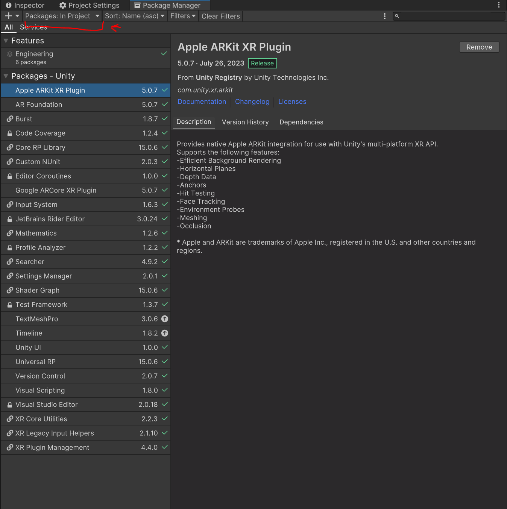

3. Install **Universal RP**

4. Install **AR Foundation**

5. Install **Google ARCore XR Plugin**

6. Install **Apple ARKit XR Plugin**

7. Click the **\+** button in the top right corner and select **install package from tarball**.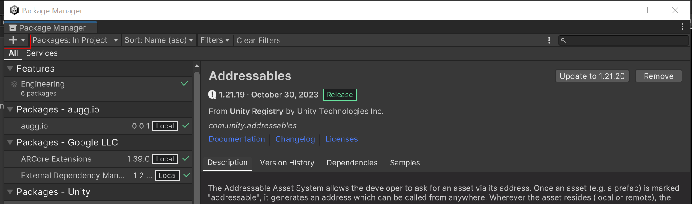

8. Install [**ARCoreExtensions**](https://developers.google.com/ar/develop/unity-arf/getting-started-extensions?ar_foundations_version=4#install_arcore) by following the tutorial by Google.

9. Click the **\+** button again and find the path to [**augg.io SDK** tarball](https://drive.google.com/drive/folders/1G6YQdCL6hBLntgNW85MH4Kbq-uW5eKXu) (tar.gz file extensions) and install into the project.

| Important: If you installed an older version of ARCoreExtensions (e.g. 1.39 which is shipped with some earlier versions of augg.io) you may have a problem with building the application to iOS 18\. To resolve this issue, upgrade to a newer version of ARCoreExtensions by following this tutorial [Upgrading ARCoreExtensions in the project](https://docs.google.com/document/d/1Yy_wTvDfwrxhLDoGXqjBlEeM5hvkOm9YVP8dkeb8WGk/edit?usp=sharing). |
| :---- |

### Setting up URP

1. Open **Settings** folder

2. Select **URP-HighFidelity-Renderer** and add **ARBackgroundRendererFeature**.  
   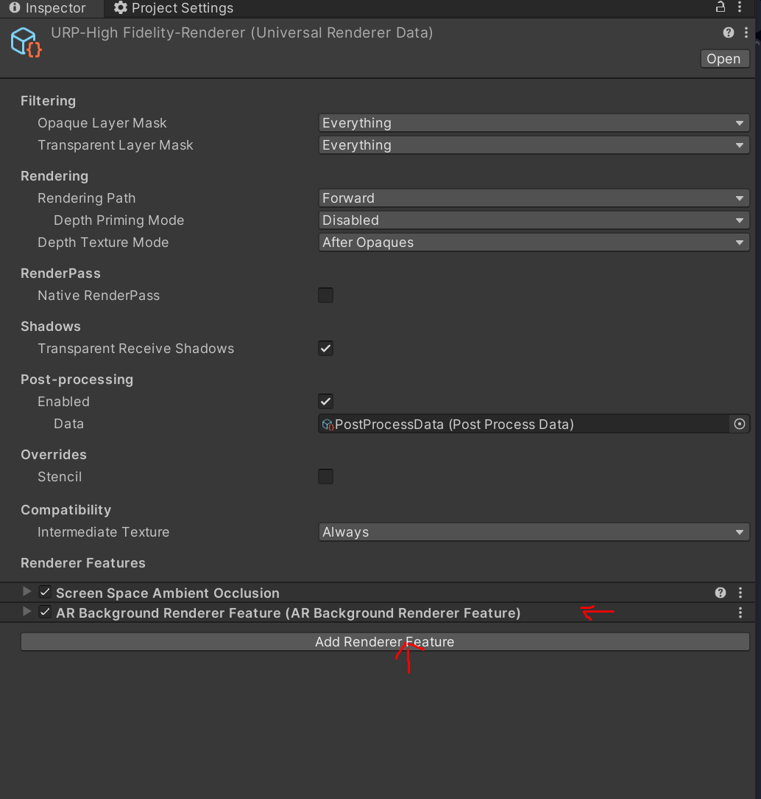

### Setting up XR

1. In Project Settings go to XR Plug-in Management

2. Set ARCore to true and confirm restart.

3. In the top menu click Edit \-\> Project Settings

4. Select Project Validation

5. If there are any issue click on Fix  
   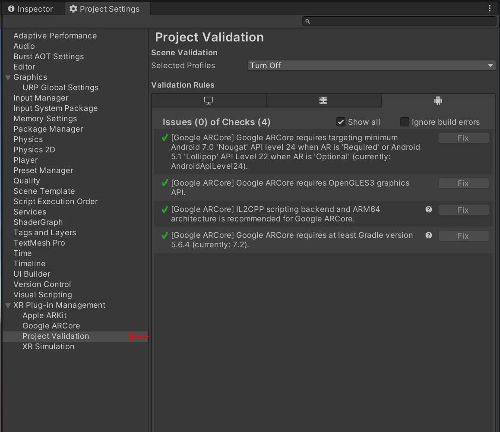

### Prepare scene

1. Create empty scene (or remove everything from the sample scene)

2. Right click in the Hierarchy window. XR \-\> AR Session

3. Right click in the Hierarchy window. XR \-\> XR Origin (Mobile AR)

4. Select XR Origin. Click add component and add ARAnchorManager (the field can be empty).  
   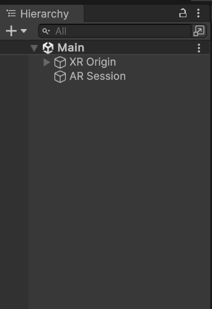

### Setup ARCoreExtension

1. Right click in the hierarchy window. Select XR \-\> ARCore Extensions

2. Fill in the first three fields. Just click and select the only option available  
   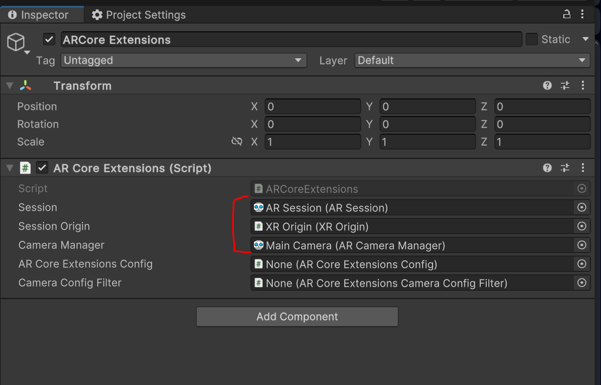

3. Go to the Settings folder.

4. Create ARCoreExtensionsConfig and CameraConfigFilter
	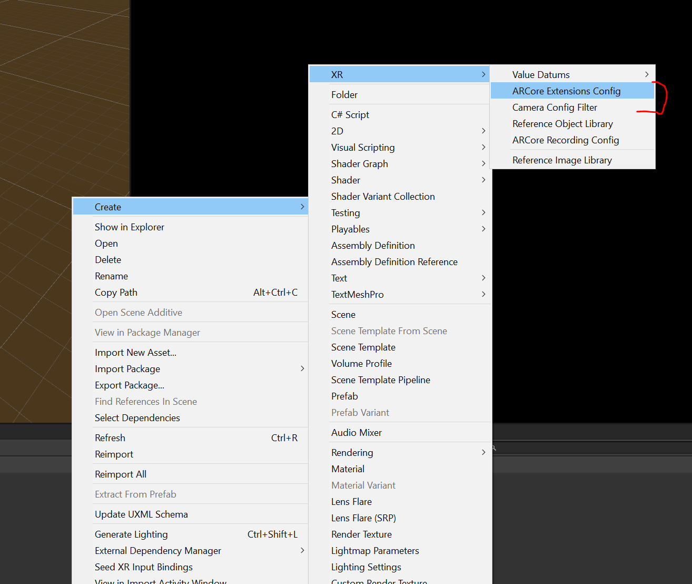

5. Select the ARCoreExtensionConfig you just created. And set Cloud Anchors Mode to enabled.  
   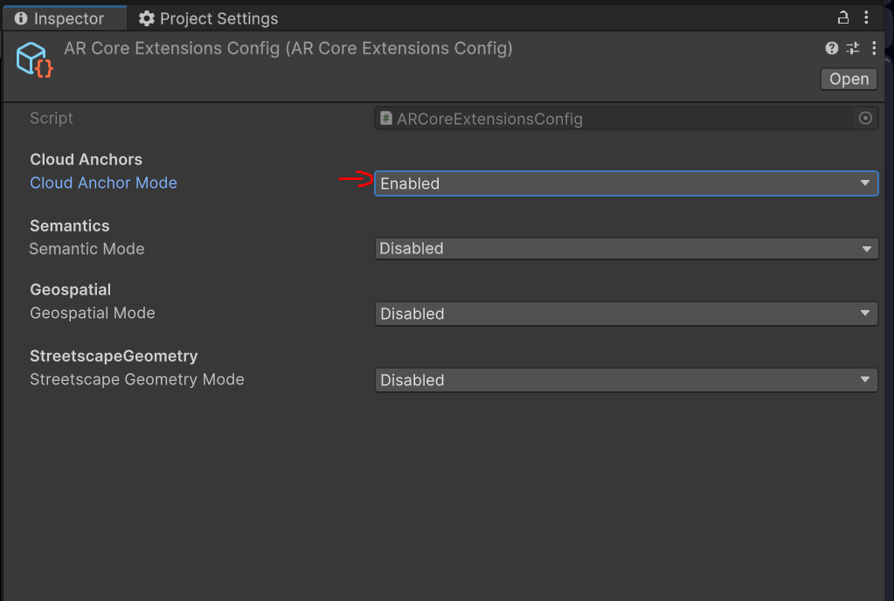

6. Select ARCoreExtension in the scene and set the two remaining fields.  
   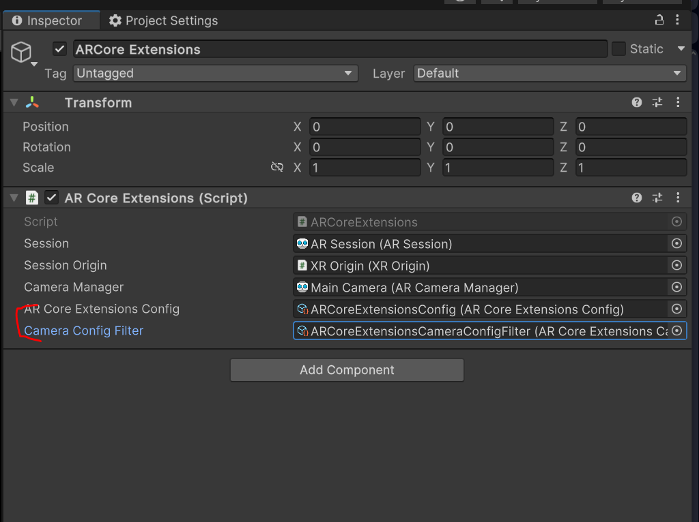

### Setting up scene

1. Open your AR scene (Main in the example project).

2. Create an empty GameObject in the scene root named **AuggioTrackingManager**.

3. Add **AuggioTrackingManager** script to the game object.

4. Add **InitializeOnSessionTracking** and set the reference to **AuggioTrackingManager**. Do this if you are not using custom initializing logic.  
   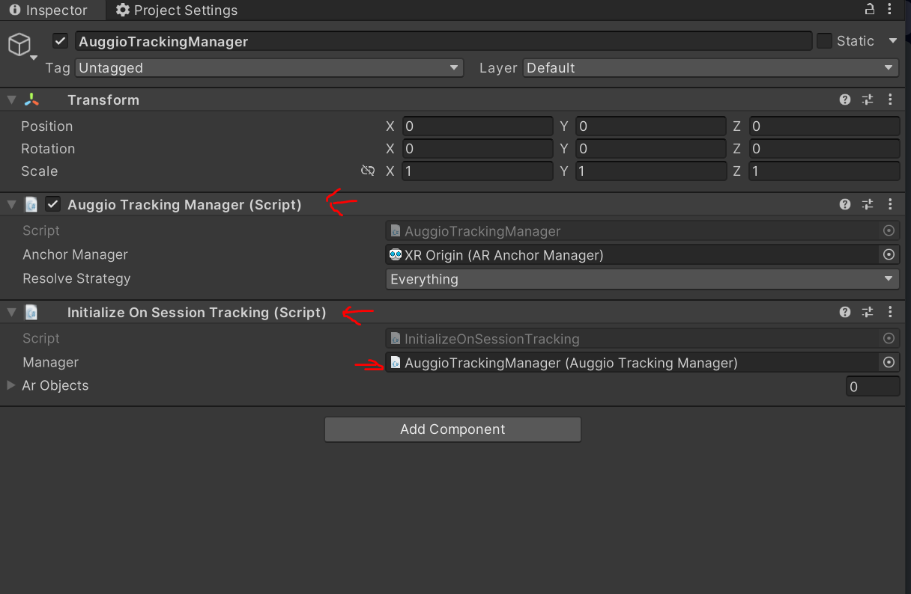

| Congratulations, you’ve made it to the end! The next part of the guide awaits you here:  [01 - Setting up augg.io in a project](01_setting_up_auggio_in_a_project.md) |
| :---- |

[image1]: images/img_00/image16.png

[image2]: images/img_00/image2.png

[image3]: images/img_00/image5.png

[image4]: images/img_00/image3.png