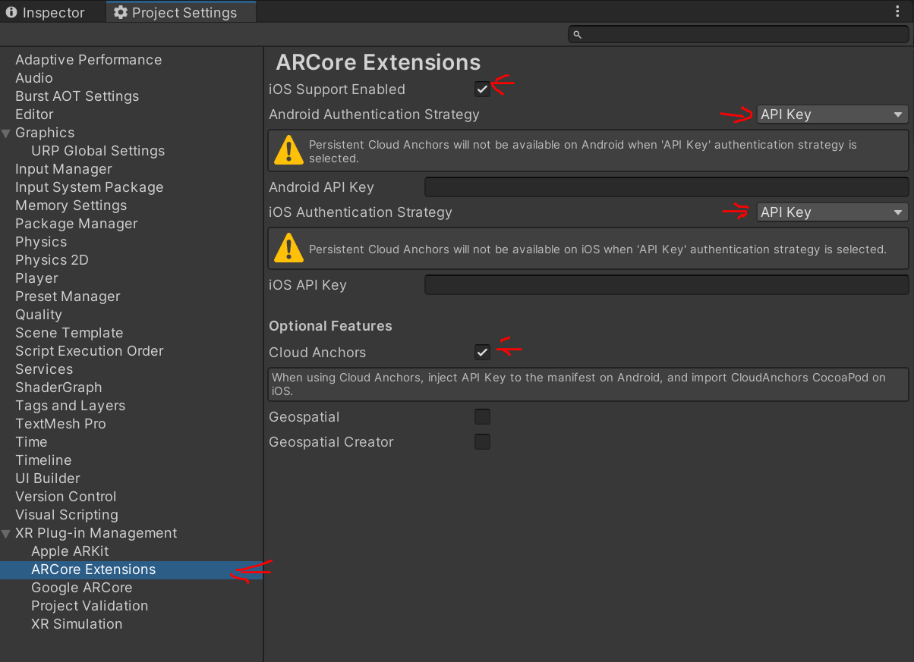
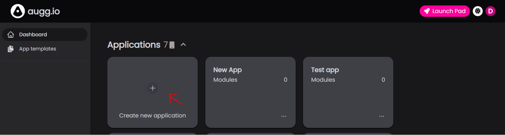
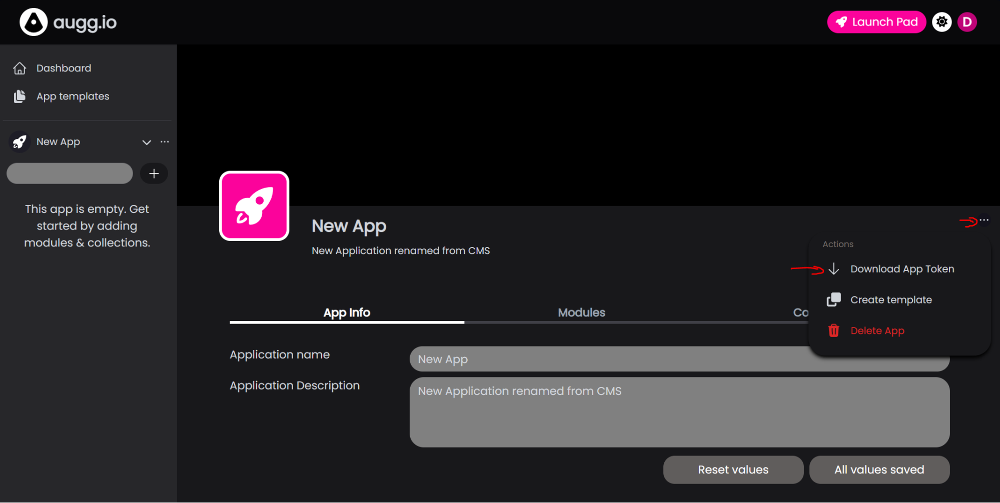
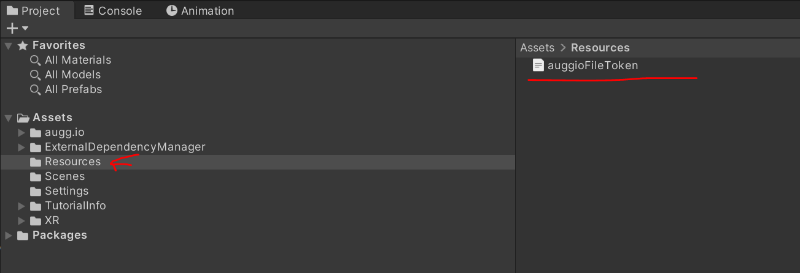

# **Setting up augg.io in a project**

## augg.io

If you are using example project start with [Setting up example project]([https://docs.google.com/document/d/1cR3WfNzGNMeHizVxRGqqJPKNSKlpdh2H8EDvVG09zR0/edit](https://github.com/augg-io/documentation/blob/main/01_setting_up_auggio_in_a_project.md)) first.

### Setting up ARCore Extensions

1. In the top menu click **Edit** \- **Project Settings** and select **ARCore Extensions**

2. Set **iOS Enabled** to true if needed

3. Set **Cloud Anchor** to true

4. Set **Authentication Strategy** to **API key**  
   

5. Fill in your [**Google Cloud Anchors API key**](https://github.com/augg-io/documentation/blob/main/02_creating_google_service_account_and_getting_google_api_key.md)**.**

6. Go to **Assets \- External Dependency Manager \- Android** and click **Force Resolve**

### Start using augg.io

1. Create an account at [**cms.augg.io**](http://cms.augg.io) or inside the scanning application.

2. Create a Blank Application in CMS.  
   

3. Open the new application.

4. Click the three dots in the right corner and select **Download App Token**  
   

5. Put your Application file token inside the **Assets/Resources** folder. It has to be named **auggioFileToken.json**.  
   

| Congratulations, you’ve made it to the end\! Need a reminder of what you’ve done earlier in the guide? The previous part is right here: [00 - Create an empty project](00_create_an_empty_projectsetting_up_auggio_in_a_project.md) The next part of the guide awaits you here:  [02 - Creating Google Service Account and getting Google API Key](02_creating_google_service_account_and_getting_google_api_key.md)  |
| :---- |
