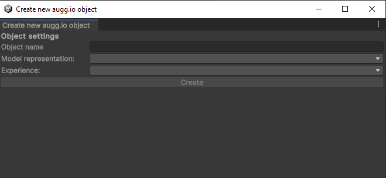
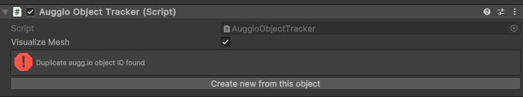

# **Using augg.io Unity Editor plugin**

## augg.io

# 

# **What is augg.io Unity Editor plugin?**

Our Unity Editor plugin extends Unity Editor with functionality related to augg.io. Its purpose is to fetch data our users capture using the scanning app and import, display and edit them inside Unity Editor. It detects changes users do to their experiences and allows them to upload them to the server. As a result users don't have to rebuild their applications and are able to see their tweaks immediately inside the app. Last but not least our plugin validates the structure of data and its representation in the Unity scene  and ensures that it stays consistent.

[Quick video  tutorial on how to use Unity with our scanning app](https://youtu.be/2RPHbdd1y3A?si=bkHJXKmxSnq7Aves)

# **Getting started**

## **Installation**

If using our example project, there is no need to install anything. Plugin is already part of this project and all that is needed is to follow the steps in [Setting up augg.io](01_setting_up_auggio_in_a_project.md) guide.

If installing augg.io to an existing project please follow the steps described [here (chapter Installing augg.io)](00_create_an_empty_projectsetting_up_auggio_in_a_project.md) and then  [Setting up augg.io](01_setting_up_auggio_in_a_project.md) guide.

## **Signing in**

Once augg.io is installed inside the Unity project, start using the plugin by clicking on **augg.io \-\> Editor Plugin** in Unity top menu bar. If there is no augg.io menu item, please make sure augg.io is installed properly and there are no compilation errors inside the Unity console.

After opening the Editor Plugin, the first thing that will appear  is a login screen. It prompts to enter augg.io API key, which can be found in our CMS ([https://cms.augg.io](https://cms.augg.io)). If [Setting up augg.io guide](01_setting_up_auggio_in_a_project.md) was properly followed, you should have an account created. To get augg.io api key please follow these steps:

1. Login to CMS   
2. Select arbitrary organization (augg.io API is tied to account not organization)  
3. Go to account menu (circular button with a letter in the top right corner)  
4. Select Settings  
5. Copy Unity API key 

# **Basic Usage**

After successfull login, the plugin home screen will appear. The organization can be selected via Select organization dropdown menu **\[1\]**, adjust plugin Settings by clicking on Settings button **\[2\]** or log out from the plugin **\[3\]**. The rest of the screen shows experiences list **\[4\]** created within the selected organization.

## **Selected Organization \[1\]**

Displays current selected organization. To switch organization simply select different organization in the dropdown menu.

## **Settings \[2\]**

Settings screen contains basic plugin properties that can be  changed to tweak behavior of the plugin. 

### Default Mesh Material on Import

This material will be used when mesh data (from scanning app) are imported  inside Unity scene.

### Show mesh on experience import

This checkbox defines whether the imported mesh in the scene will be immediately displayed after import. If set to false, mesh can be then manually displayed by checking the Visualize Mesh checkbox on Visualization Hierarchy or any of its children.

## **Logout \[3\]**

Logout button returns user to the login screen and removes the current API key from cache.

## **Experiences \[4\]**

Experience list shows experiences created within the selected organization that have at least one reviewed anchor in their location. This means that if you create some anchors in location, assign this location to the experience but leave out the review process of the anchors inside our scanning app, this experience won’t show in the list.

Each item in the experience list works as a button. Click to display experience details. 

If there is already one or more experiences imported in the current opened scene, there will be a small Unity logo in the right part of the experience button and text *(in scene).*

## **Experience detail**

After clicking on any experience button in the experiences list, the experience detail screen will display. Here are a couple of things \- Experience name **\[4.1\]**, Import scene from server button **\[4.2\]**, Local scene changes section **\[4.3\]** with a force refresh button **\[4.4\]** and Anchors section  **\[4.5\]** with a Download meshes button **\[4.6\]**. Let’s explain them in more detail.

### Experience name \[4.1\]

This is pretty straightforward. The only thing worth mentioning is that once the experience is in the scene a small Unity logo will appear at the left side of the experience name to indicate the experience is really in the scene and connected to the plugin.

### Import scene from server \[4.2\]

This button will import experience data into the current opened scene and create a GameObject hierarchy with scripts augg.io needs and expects in order to function properly. See [**Exploring the experience hierarchy**](#exploring-the-experience-hierarchy) chapter for more information.

After clicking the button, there can be an option (depends if meshes are already downloaded or not) to download meshes for the anchors. 

- If agreed, the scanned mesh data can be displayed inside the Scene view.   
- If not, only anchors and augg.io object positions are returned.

*Mesh data can be always downloaded later. Its purpose is to better understand and navigate in the scene and place AR content properly but it’s not necessary for augg.io SDK to work since meshes are not included in built applications anyway.*

After the data is imported a few changed can be noticed:

- It generates our custom Game Object Hierarchy. See [**Exploring the experience hierarchy**](#exploring-the-experience-hierarchy) chapter for more information.

- It creates some .json files in the file system inside the **Assets/[augg.io/data](http://augg.io/data)** folder \- see [**Automatically generated files**](#automatically-generated-files) chapter for more information.

- The Import scene from the server button becomes hidden and there are some additional actions instead.

| 
Validate scene \[4.2.A\] This button will validate the integrity of the scene. It shows a special window where the problematic game objects (if any) are displayed. See [Data Validation](#data-validation) chapter for more information. Upload local changes to server \[4.2.B\] This button shows only if there are any local changes present in the [Local Changes \[4.3\]](#local-scene-changes-[4.3]) section. It tries to upload local changes done to the experience to the server. It does the validation process before uploading so it won’t accidentally upload invalid data. If validation succeeds the local changes are uploaded to the server. However if the server has changes (e.g. someone else edited the experience after you last updated it) it asks if it should overwrite the server changes. Vice versa, local changes can be discarded (and the server state can be kept) by using [Update scene from server button \[4.2.C\]](#update-scene-from-server-[4.2.c]).  *Unfortunately there is no merging mechanism of the changes yet. So it is always keep yours or keep theirs. See [Known issues](#known-issues) chapter for more information.* Update scene from server \[4.2.C\] Updates experience data from the server. If there are any local changes, it will ask whether to discard them or not. Server changes status \[4.2.D\] Shows whether there are changes to the experience data on the server against the local state. If there is a green check mark the local state matches the server state. If not, the server state is different and updating the scene from server [\[4.2.C\]](#update-scene-from-server-[4.2.c]) should be considered. |
| ----- |

### Local Scene Changes \[4.3\] {#local-scene-changes-[4.3]}

This section tracks whether there are any supported local changes to the experience \- see [**Local scene changes detection**](#local-scene-changes-detection) chapter for more information. It then shows the changes in a list. 

For each change there is an object identifier to which object the change belongs to, what type of change has been done, old value, new value and supported actions for the specific change.

***Example:** We moved **\[Object\] PortalPrachovky** gameobject 1.82 meters up. In the image there is exactly this change with the ability to select the game object in Hierarchy by clicking Select in Scene button or discarding the change by using Discard button.*

Force Refresh Button \[4.4\]

Plugin window and therefore the local changes should refresh every time the window is focused (click inside the window). But if it doesn’t happen, this button can be used to force reloading the local changes section.

### Anchors \[4.5\]

This section displays the anchors that are assigned to the experience. For each anchor it shows its name, a location to which it belongs and whether the scanned mesh is downloaded in the file system or not (red X if not, green checkmark if yes).

*Example: All meshes for all anchors are downloaded*

### Download meshes button \[6\]

If there are any meshes that are not present in the file system, this button will download them from our server and save them so location can be displayed in the scene.

# **Exploring the experience hierarchy** {#exploring-the-experience-hierarchy}

After importing experience into the current scene, augg.io plugin generates specific game object hierarchy inside the Hierarchy tab. The top level object should have name **\[Experience\] Experience name** and should have **AuggioExperience** script attached to it. Let’s explain what the children of that game object represent and how they work.

*Example \- Valid experience hierarchy*

## **Visualization Hierarchy**

VisualizationHierarchy game object contains data game objects which are responsible for displaying the scanned meshes and anchors in the scene view. It has **VisualizationHierarchy** script attached where a couple of things can be set up:

- **Material** \- sets defined material to all renderers under Visualization Hierarchy game object  
- **Visualize Mesh** \- if checked all the meshes for whole experience will be displayed in the scene view

### Locations

Under **VisualizationHierarchy** there is a game object for each location assigned to the experience. Each location has **AuggioLocation** script attached to it where the visualization of the location meshes can be selectively turned on/off .

### Anchors

Each location has a game object for each of its anchors. Each anchor has **AuggioAnchor** script attached to it, where settings like material or mesh visualization can be overridden for each anchor selectively.

In the Scene view there is a gizmo representation of the anchor which represents anchor position and rotation.

| Please note that any object inside Visualization Hierarchy or Visualization Hierarchy itself must not be moved\! Otherwise strange behavior may occur  where the objects won’t be in their expected positions in AR. If the experience needs to be moved somewhere else in the scene, always move the top level Experience object. Our plugin should automatically disable all moving options of such gameobjects. |
| :---- |

## **Objects**

Objects are the most interesting game objects in this hierarchy. It is the place under which content is put. Each object is assigned to one of the anchors relative to which augg.io tracks the object position. So when a specified anchor gets detected, the object spawns on position relative to that anchor. An object has a parent anchor, a name and can have one or more simple model representations \- object placeholders (cube, capsule, sphere …)

Each object has an **AuggioObjectTracker** script attached which is responsible for tracking the object. Following properties can be changed: object’s parent anchor, name of the object or whether object’s simple model representation should be shown in scene view (Visualize Mesh).

.

If an object is selected in the scene view or the hierarchy, the simple model representation will be **highlighted and a dotted line** will appear representing which anchor is the object tied to.

### Object Placeholders (optional)

Each object can have 0 to N simple model representations which we call object placeholders. These placeholders can be useful in the early phase of development when the user needs to just design where the final content should be. These object placeholders can then be viewed in AR inside our scanning application. Object placeholder can have one of the simple shapes:

- Cube  
- Sphere  
- Capsule  
- Cylinder

Each placeholder object has an **AuggioObjectPlaceholderModel** script attached to it where the name of the placeholder object and its  simple model representation can be set.

### Detach Strategy (optional)

By default after an anchor and its object are resolved, the object stays as a child of that anchor. The anchor position (and therefore object position) gets updated by the underlying AR system (currently ARFoundation) during the session. Sometimes this behavior is not desired e.g. we would like to attach the object to the closest plane and get its position updated with the plane rather than the  anchor. Or we want to detach it completely and let it live in the AR space by itself. 

These are cases where a Detach strategy comes into play. You can specify one detach strategy per object. The detach strategy is executed right after the object is found. You can use one of our predefined detach strategies (e.g. Plane snapping detach strategy) or you can create your own by extending AbstractDetachStrategy class.

#### Adding detach strategy to the object

Select \[Object\] game object in Hierarchy tab or in scene view which you would like to add the detach strategy to. You can use the **Add detach strategy** button in AuggioObjectTracker inspector, where you can select from our predefined strategies. If you created your own, you will have to add this script to the \[Object\] manually (e.g. by using the **Add Component** button).

### Creating new object

**Recommended** ways to create new object:

- Using our wizard in Hierarchy tab   
- Using AuggioExperience inspector  button  
- Using AuggioAnchor inspector button

Other ways to create new object:

- By duplicating existing object and put it under Experience game object  
- Creating a new empty game object under Experience game object with **AuggioObjectTracker** script attached.

#### Using wizard in Hierarchy tab

**Right click inside Hierarchy tab \-\> augg.io \-\> Add new object**. A Create new augg.io object window should appear. Set the following values: 

- Object name  
- Model representation   
  - wizard will create placeholder object under auggio object with specified model representation  
  - if selecting \<None\> object will not have a placeholder object  
- Experience \- to which object should be assigned  
- Parent anchor \- to which anchor object should be linked to

 After setting all values click on the **Create button**.

*Create new augg.io object window*

*Create new augg.io object window \- filled in*

#### Using AuggioExperiece inspector button

Select \[Experience\] game object in scene or in Hierarchy tab under which you want to add new augg.io object. In Inspector tab you should see AuggioExperience script attached to this game object. This script has the “**Add new augg.io object”** button under the Actions section. 

After clicking on this button, a wizard will appear. The wizard is the same one described in the previous section, but the Experience dropdown value is pre filled and cannot be changed.

#### Using AuggioAnchor inspector button

Select desired \[Anchor\] game object in scene or in Hierarchy tab which you would like to tie the new object to. \[Anchor\] game objects are under \[Experience\] \-\> Visualization Hierarchy \-\> \[Location\]. In Inspector tab you should see AuggioAnchor script attached to this game object. This script has the “Add new augg.io object tied to this anchor” button under the Actions section.

After clicking on this button, once again a same wizard as in previous sections will appear and will have experience and anchor dropdown values predefined and not changeable.

#### Creating object by duplicating existing object

The second way will result in an error  displayed in the Inspector tab. By clicking on **Create new from this object** the error should be resolved.

*Duplicate augg.io object error after duplicating existing object*

#### Creating object from scratch (new empty game object)

The third way will result in multiple consequent errors in the Inspector tab. By clicking on **Try to fix** the information should be filled.

1. *Missing information error after creating empty gameobject with **AuggioObjectTracker***

(Optional) After fixing auggio object, object placeholders may be added under it. To do so, add a new empty game object as a child of the **AuggioObjectTracker** object and attach the **AuggioObjectPlaceholderModel** script to it.

After that, fill in the name of the newly created placeholder object and there will be one last error, that placeholder object is not correctly assigned to the object. By clicking **Try to fix**, all errors should be resolved.

2. *Not assigned error after creating a child gameobject under **AuggioObjectTracker** with **AuggioObjectPlaceholderModel** script.*

### Creating new object object placeholder

Similarly to creating new augg.io object you can create new object placeholder in multiple ways:

**Recommended ways:**

- Using wizard in Hierarchy tab  
- Using wizard through AuggioObjectTracker inspector button

**Other possible ways:**

- Duplicating existing placeholder object  
- Create placeholder object from scratch

#### Using wizard in Hierarchy tab

**Right click inside Hierarchy tab \-\> augg.io \-\> Add new placeholder object**. A new window should appear. Set the following values:

- Placeholder name (name of the placeholder object \- cannot be empty)  
- Model representation (primitive object that will represent the placeholder)  
- Experience (under which experience you would like to create the placeholder)  
- Auggio object (under which object you would like to create the placeholder)

After setting the values, the Create button should become active. By clicking on it a new game object should be created under defined \[Object\].

#### Using wizard through AuggioObjectTracker inspector button

Select \[Object\] game object in Hierarchy tab or in scene view under which you would like to add the new placeholder object. Once selected you should see AuggioObjectTracker script attached to this game object in the Inspector tab. This script has a “Add Placeholder” button in the Actions section.

After clicking on this button the same wizard as described in the previous section will appear. However it will have the Experience and Auggio object values pre filled and not changeable.

#### Creating placeholder object by duplicating existing one

If you duplicate an existing placeholder object you will see an error on both duplicate and original placeholder objects in the Inspector tab saying that a **Duplicate placeholder ID was found**. You can create a new ID for duplicate or original and therefore resolve this error by clicking on the **Try to fix** button. Please note that this will also change the placeholder name to **New placeholder model**, so don’t forget to rename it properly.

#### Creating placeholder object from scratch

You can also just create a new game object as a child of any \[Object\] game objects and attach AuggioObjectPlaceholderModel script to it. You will see two errors in the Inspector tab.

First one can be resolved by specifying the name inside the Placeholder Name text field.   
The second error can be resolved by clicking on the **Try to fix** button. Please note that if the object is not a child of \[Object\] game object, the fixing process will not be successful.

# **Automatically generated files** {#automatically-generated-files}

When importing or updating a scene from server augg.io plugin automatically generates some files inside **Assets/[augg.io/data](http://augg.io/data)** directory.

## **Experience files**

Plugin generates a file for each experience data on import under **Assets/[augg.io/data](http://augg.io/data)/\<organization\_id\>/experiences** folder, which contains the state of data after the last sync with the server. Using the contents of this file augg.io plugin is able to detect local changes. If the same experience is edited on multiple devices and the changes could not be uploaded to the server after each set of changes (e.g. because the app is already live), these files need to be shared between these devices e.g. via VCS (Version control system).

#### Removing unused experience files

Please note that if experience is present in the active scene, the experience files will be re-downloaded if not present after you enter the Experience detail screen in augg.io Editor window. 

If you wish to permanently delete the experience files, please remove experience from all of your scenes. Then open augg.io Editor Window and go to Experience detail. In the Actions sections there is a **Delete experience data** button, which will remove the data from your file system.

## **Mesh data files**

After downloading meshes, the augg.io plugin creates files under the **Assets/[augg.io/data](http://augg.io/data)/mesh\_data** folder. These files can also be shared between devices (e.g via VCS) but it is not necessary, since the meshes cannot be changed \= do not hold any state and can be always downloaded again on other devices. 

These files can also be quite big, so if using VCS like Git, you may not want to include them. With the information said before, they can safely be put among ignored files (e.g .gitignore).

#### Removing mesh data files

If you wish to remove data from the file system, you can either delete them manually or go to Experience detail screen in augg.io Editor Window. In the **Actions** section there is a **Delete all meshes** button, which will delete all meshes associated with the selected Experience from the file system.

You can also delete meshes selectively for each anchor by clicking the **Delete** button in the Anchors section.

Please note that anchors can be shared between experiences, so deleting meshes can affect other experiences.

However meshes are not crucial for augg.io to run, they are only used as visual reference in the scene view. You can always redownload them if needed.

# **Local Scene Changes Detection** {#local-scene-changes-detection}

Plugin detects supported local changes that have been done since the last update (sync) from the server. 

Supported changes are:

- Changing name of the augg.io object  
- Creating new augg.io object  
- Delete augg.io object  
- Change augg.io object position  
- Change augg.io object rotation  
- Change augg.io object scale  
- Change augg.io model representation  
- Change augg.io object assigned anchor  
- Create new placeholder object under augg.io object  
- Delete placeholder object under augg.io object  
- Change placeholder object position  
- Change placeholder object rotation  
- Change placeholder object scale  
- Change placeholder object name

**The changes are displayed in the plugin editor window, where can be discarded or uploaded to the server.**

| Transform changes to augg.io objects or its placeholders can be done by simply moving them in the Scene view or changing their Transform component. |
| :---- |

| Creating and deleting objects or placeholders can also be done intuitively by deleting or creating them in the Experience hierarchy. |
| :---- |

| Changing assigned anchors or names of objects have to be done in the Inspector via AuggioObjectTracker or AuggioObjectPlaceholderModel script properties in order to be detected. |
| :---- |

# **Data validation** {#data-validation}

When trying to upload local changes to the server or click on Validate scene in augg.io Editor Plugin window, augg.io permors data and scene validation. If any objects under Experience objects in the scene have errors, it will be displayed in the validation window. Common issues are e.g.

- Missing object name  
- Missing object placeholder name  
- Duplicate augg.io object  
- Unassigned placeholder object  
- etc.

The validation window provides a Select in scene button which selects the problematic game object and the issues are displayed in the Inspector tab e.g

*Example \-  Auggio Object Placeholder is missing name*

Some of these errors like missing names must be fixed manually but to some of them augg.io provides automatic solution via button under the error e.g

*Example \- Object placeholder is not assigned to any augg.io object*

| If errors cannot be fixed automatically via the fix button there are probably some issues in the Experience hierarchy. See [Exploring Experience hierarchy](#exploring-the-experience-hierarchy) chapter to see what may be wrong or delete and re import whole experience (please note that this way local changes may be lost) |
| :---- |

# **Best Practices**

## **Do not change transform (move,rotate,scale) other game objects in Experience hierarchy other than Objects and Object Placeholder**

If the visualization hierarchy, location or anchor is moved, you can forget it and then move objects to match this shifted visualization. And then the objects will be in different positions than expected. If you really need to move the visualization somewhere else in the scene (e.g there are multiple experiences in the scene) move or rotate the top level Experience object. Scaling is not recommended even on this object. But the best practice is to keep the Experience object on 0,0,0 as well.

## **Uncheck VisualizationHierarchy \-\> Visualize Mesh before build**

Although nothing from the visualization hierarchy will be shown in, we recommend to hide the visualization hierarchy before building the application. Even empty game objects can cause a little overhead. When the checkbox is unchecked, the mesh game objects are destroyed therefore not present in the scene.

## **Share automatically generated files via VCS**

If editing the experience on multiple devices, you need to share automatically generated files for experiences in order to keep the local state of experience synced. When it comes to mesh data, it is entirely your choice but we prefer to share it as well.

## **Don’t forget to save the scene**

A lot of changes done to the experience hierarchy will set the scene as dirty (= needs to be saved). Don’t forget to do so now and then\!

## **Discard changes via Editor window**

Although CTRL \+ Z should not corrupt the Experience hierarchy, it is possible that there are some edge cases, which we didn’t catch. Discarding changes via the Editor window is always better.

## **Renaming objects and object placeholders**

Do not rename the objects directly in Hierarchy but using property in AuggioObjectTracker or AuggioObjectPlaceholderModel script in the Inspector tab. If the object is renamed directly it won’t be considered as a local change to the name of that object.

# **Known Issues** {#known-issues}

## **Losing local changes when updating from server and vice versa**

Currently augg.io does not have a mechanism that will merge the changes done to the experience at the same time. Even if you and your colleagues work on entirely different augg.io objects. We are aware of that and we plan to design and implement such a mechanism in the future.

## **Corrupted experience data**

Sometimes the data becomes corrupted when the user does an unexpected action. **We are actively working to cover all the edge cases which may happen during editing the experience**. If you manage to break it and you know how that happened, please fill in a report in \#bug-reporting channel on our discord\!  [https://discord.gg/RBYyFdDw](https://discord.gg/RBYyFdDw) 

Unfortunately when this happens the only resolution is to delete and re import the experience. And if you manage (due to some uncovered edge case) to upload such a corrupted experience on a server it may entirely destroy the data for everyone and you may need to start from scratch. So please be mindful of errors displayed in the console and our Editor window and make sure there are no errors before uploading the changes to the server\!

## **augg.io does not delete experience files when deleting experience from scene**

Since the editor plugin has access only to the current opened scene, it can’t possibly know if the experience isn’t imported in another. Therefore we cannot remove the data automatically. If you wish to permanently delete the experience files, please remove experience from all of your scenes. Then open augg.io Editor Window and go to Experience detail. In the Actions sections there is a **Delete experience data** button, which will remove the data from your file system.

# **Troubleshooting**

## **I downloaded meshes and they are not visible in my scene view**

If you successfully downloaded meshes and they are not visible in your scene view simply select Visualization Hierarchy object under your \[Experience\] game object and turn off and on Visualize mesh property in the Inspector tab. Or you can do it selectively for each \[Location\] or \[Anchor\].

## **I deleted meshes and they are still visible in my scene view**

If you deleted meshes and they are still visible in your scene view they are cached within the Scene. Simply select Visualization Hierarchy under your \[Experience\] game object and turn off Visualize Mesh Property in the Inspector tab. This will destroy cached mesh game objects in Scene view. 

You can check that the mesh files are indeed deleted by turning the Visualize Mesh property back on. You should see the following error in the Console.

