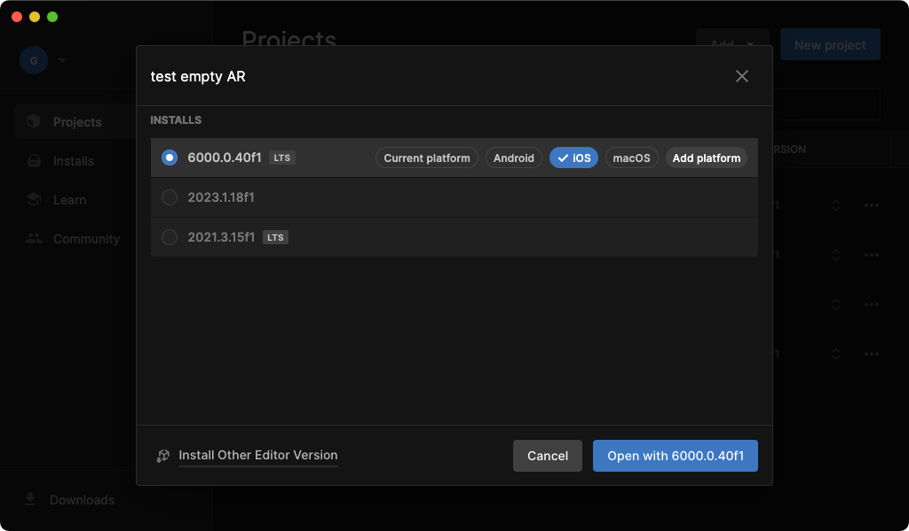

# 

# **Upgrading to Unity 6**

## augg.io

## **Table of Contents**

1. [Introduction](#introduction)  
2. [Step 1: Opening the Project in Unity 6](#step-1-opening-the-project-in-unity-6)  
3. [Step 2: Confirm Updated Packages](#step-2-confirm-updated-packages)  
4. [Step 3: Upgrading ARCore Extensions](#step-3-arcore-extensions)  
5. [Step 4: Updating Auggio SDK](#step-4-updating-auggio-sdk)  
6. [Step 5: Confirm Final Build](#step-5-confirm-final-build)  
7. [Conclusion & Troubleshooting](#conclusion--troubleshooting)

## **Introduction**

Unity 6 offers performance improvements, updated package versions, and a more stable environment for builds. However, upgrading from an older version can sometimes cause issues, especially with package compatibility. This guide addresses common pitfalls and walks you through the steps to ensure a successful build.

## **Step 1: Opening the Project in Unity 6**

1. **Open Unity Hub**, select your project and change to Unity 6 version, you can already choose to open the project for iOS or Android builds.

2. When prompted about version changes, **acknowledge any warning pop-up** indicating potential compatibility issues.  
3. If Unity flags errors on the first project load, do not switch to Safe Mode, just continue while ignoring it. Some errors may appear due to partial project re-compiles. Often, simply **closing and reopening** the project in Unity 6 fixes them.  
4. If you see a prompt to update **TextMeshPro Essentials**, allow Unity to import them.

## **Step 2: Confirm Updated Packages**

Unity 6 may automatically update certain packages, but you should verify:

- **Universal RP**  
- **AR Foundation**  
- **Google ARCore XR Plugin**  
- **Apple ARKit XR Plugin**

Use the Package Manager (Window \> Package Manager) to confirm they are all on version **6.0.5** (or whichever latest version that Unity 6 typically sets). Make sure any other packages that you rely on are also properly updated.  

Refer to the [00 - Create an empty project](https://github.com/augg-io/documentation/blob/main/00_create_an_empty_projectsetting_up_auggio_in_a_project.md) for further installation details if needed.

## **Step 3: ARCore Extensions**

If you don't have ARCore Extensions in your project, you can follow [**this Google tutorial**](https://developers.google.com/ar/develop/unity-arf/getting-started-extensions?ar_foundations_version=4#install_arcore)  to install it.

However if your project has older versions of ARCore Extensions (e.g. 1.39) follow the official [Upgrading ARCoreExtensions in the project](https://github.com/augg-io/documentation/blob/main/Upgrading_ARCoreExtensions_in_the_project.md) manual step by step, **or your build might not work**.

## **Step 4: Updating Auggio SDK** 

If your project uses the **Auggio SDK**, upgrade it to **version 0.0.3-b1** (or the latest recommended version). Follow the instructions in the [00 - Create an empty project](https://github.com/augg-io/documentation/blob/main/00_create_an_empty_projectsetting_up_auggio_in_a_project.md), 9\. point, just after the "Install ARCoreExtensions" step to ensure the process completes smoothly.

## **Step 5: Confirm Final Build** 

1. Verify there are **no console errors**.  
2. Open **Build Settings** (File \> Build Settings), switch to **iOS/Android** if not already, and run a **test build**.  
3. If the build succeeds, you’re ready to continue developing the project.

## **Conclusion & Troubleshooting**

Upgrading to Unity 6 can bring about some initial file recompilation errors that disappear on the second launch. By following the above steps—particularly updating ARCore Extensions and the Auggio SDK—you should resolve most issues encountered during the upgrade process.

If you still run into difficulties:

- While upgrading ARCore Extensions if you know you missed a step or done them in the wrong order, you might unfortunately have to **start the process over**.  
- **Try re-importing** any problematic packages.  
- **Look** at Unity’s logs in **Console** for details on missing or incompatible references.  
- **Consult** the relevant integration manuals (Augg  wio, ARCore, ARKit, etc.) directly.

By following these steps, you’ll ensure a clean upgrade path from earlier Unity versions to Unity 6\.
