# **Using Collections**

## augg.io

# **Collections in augg.io CMS**

Collections allow you to manage dynamic content within your augg.io applications. This guide will walk you through creating and managing collections, defining schemas, and working with collection items.

## **Creating a Collection**

To create a new collection:

1. Navigate to your application in the CMS  
2. Click the plus button and select "New Collection"  
3. Enter a name for your collection

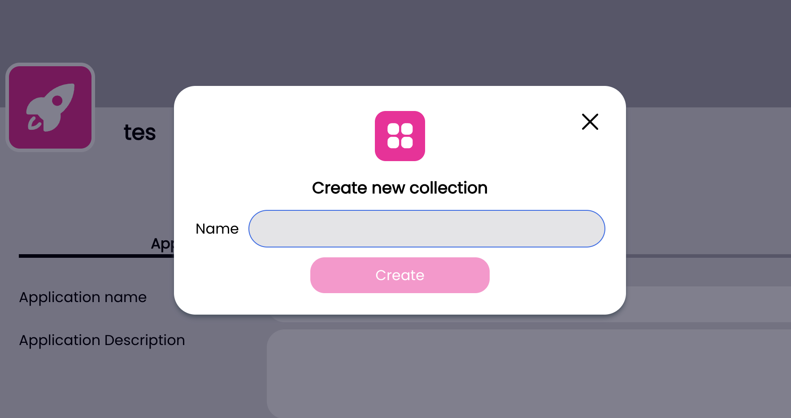

## **Managing Collection Schema**

The schema defines the structure of your collection items. To set up a schema:

1. Select your collection from the list  
2. Click "Edit Schema" to open the schema editor  
3. You'll see the schema editor interface with a "Collection fields" heading  
4. Click the "Add field" button to start adding fields to your schema

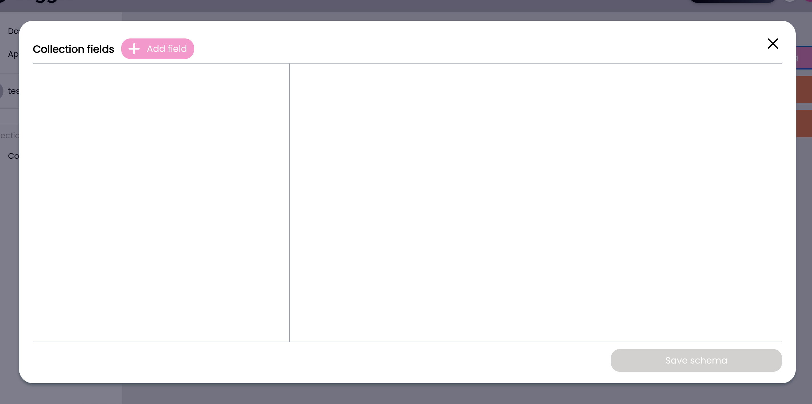

### **Adding Fields to Schema**

When you click the "Add field" button, a new dialog opens where you can configure your field:

1. Enter a name for your field  
2. Select the field type from the following options:  
   - Text: For storing text content  
   - Number: For numeric values  
   - Boolean: For true/false values  
   - Color: For color selection  
   - Option: For predefined choices  
   - Date: For date values  
   - E-mail: For email addresses  
   - Link: For URL storage
   - augg.io Object Reference: For linking collection row data to specific augg.io object
  
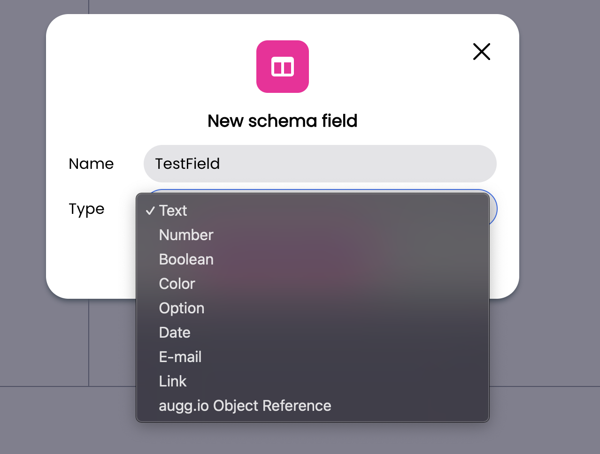

### **Field Type Details**

#### **Text Field**

The Text field type provides the following configuration options:

- Field name: The identifier for your field  
- Is required?: Toggle to make the field mandatory  
- Is text area?: Toggle to enable multi-line text input  
- Default text: Set a default value for the field  
- Placeholder: Add helper text that appears when the field is empty  
- Max Length: Set a character limit for the field

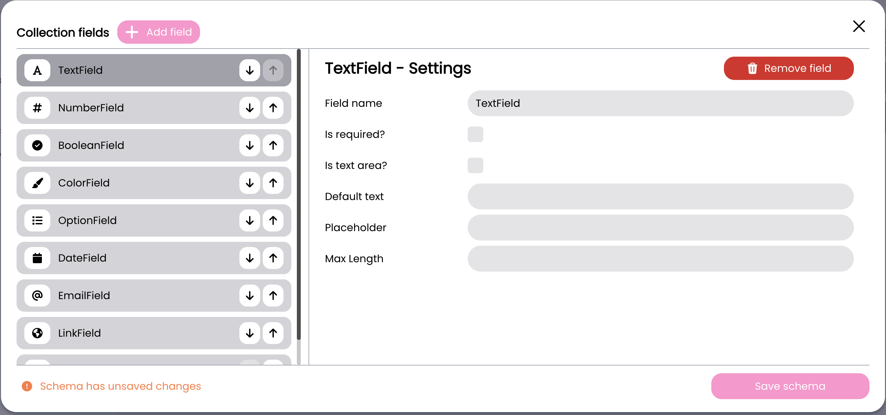

#### **Number Field**

The Number field type provides the following configuration options:

- Field name: The identifier for your field  
- Is required?: Toggle to make the field mandatory  
- Step: Define the increment/decrement step size  
- Check minimum value?: Toggle to enable minimum value validation  
- Minimum value: Set the lowest allowed value (when minimum value check is enabled)  
- Check maximum value?: Toggle to enable maximum value validation  
- Maximum value: Set the highest allowed value (when maximum value check is enabled) 

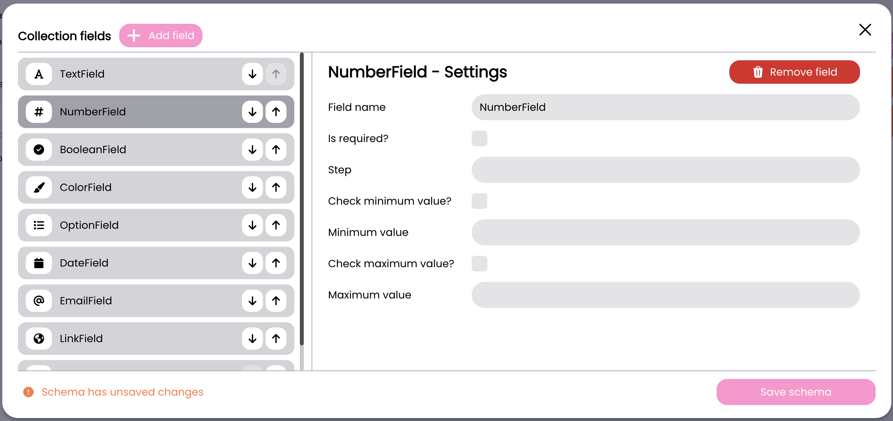

#### **Boolean Field**

The Boolean field type provides simple true/false configuration:

- Field name: The identifier for your field  
- Default value: Toggle to set the default state (true/false)

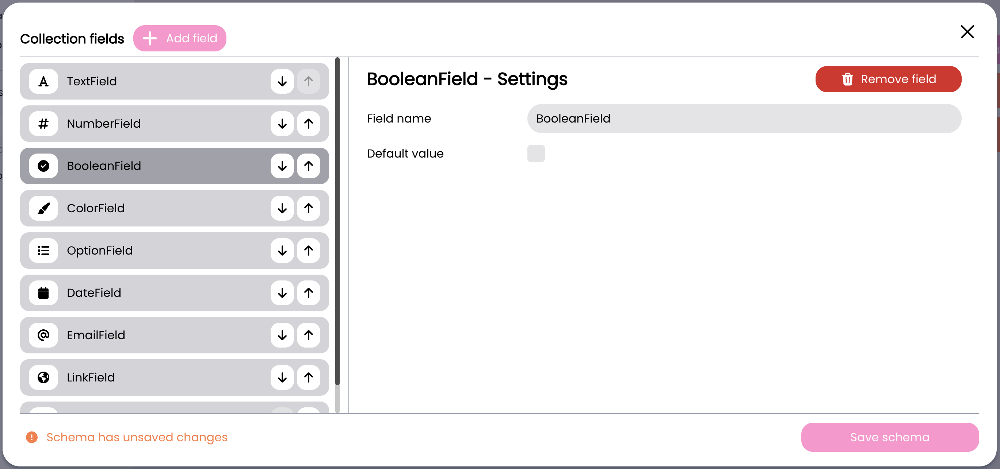

#### **Color Field**

The Color field type provides color selection configuration:

- Field name: The identifier for your field  
- Is required?: Toggle to make the field mandatory  
- Default value: Color picker to set the default color

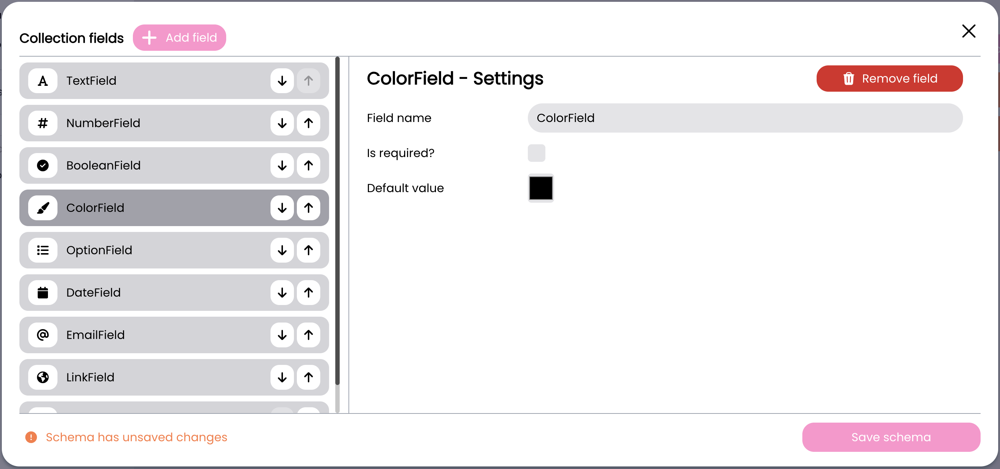

#### **Date Field**

The Date field type provides datetime configuration with UTC handling:

- Field name: The identifier for your field  
- Is required?: Toggle to make the field mandatory  
- Default value (UTC): Set the default date/time (input in local time, displays in UTC)  
- Min date (UTC): Set the earliest allowed date/time (input in local time, displays in UTC)  
- Max date (UTC): Set the latest allowed date/time (input in local time, displays in UTC) Note: All date inputs are entered in local time but are stored and displayed in UTC format.

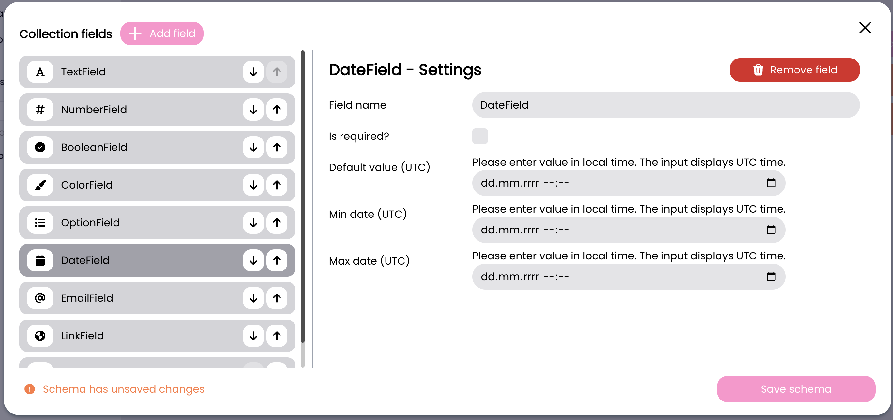

#### **E-mail Field**

The E-mail field type provides email address configuration:

- Field name: The identifier for your field  
- Is required?: Toggle to make the field mandatory  
- Default value: Set a default email address.

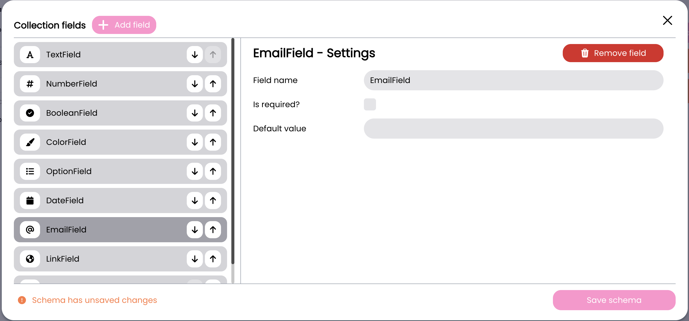

#### **Link Field**

The Link field type provides URL configuration:

- Field name: The identifier for your field  
- Is required?: Toggle to make the field mandatory  
- Default value: Set a default URL  
- Allow http?: Toggle to allow non-https URLs (disabled by default for security)

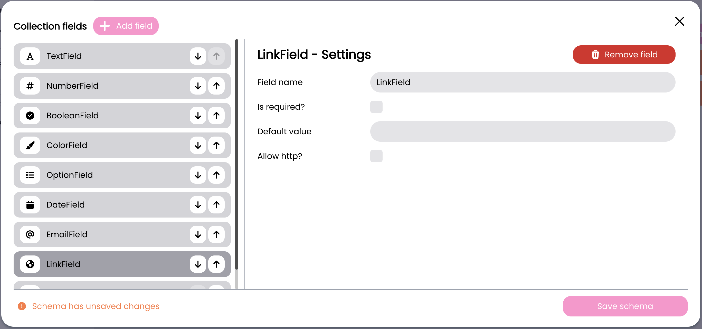

#### **Option Field**

The Option field type allows you to:

- Field name: The identifier for your field  
- Is required?: Toggle to make the field mandatory  
- Options: Add and manage a list of predefined choices.

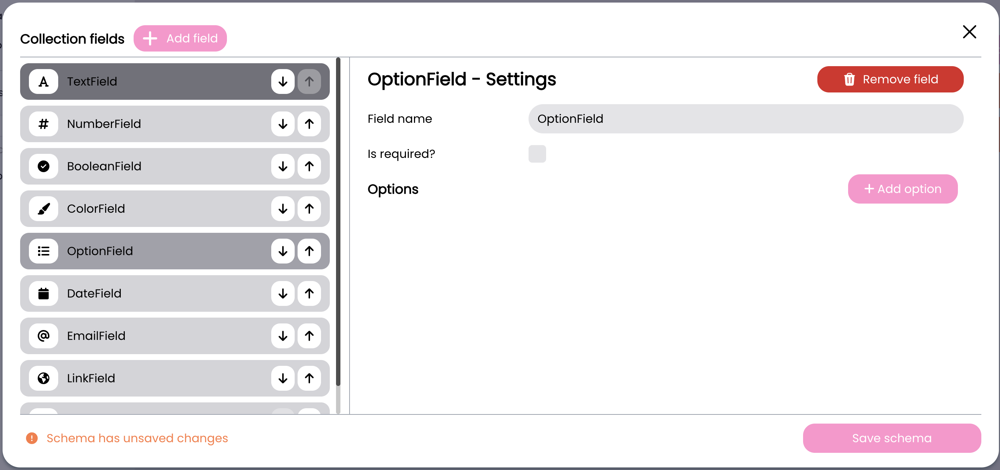

#### **augg.io Object Reference Field**

The augg.io object reference field type allows you to:

- Field name: The identifier for your field
- Is required?: Toggle to make the field mandatory
- Unique?: Whether value should be unique in the entire column

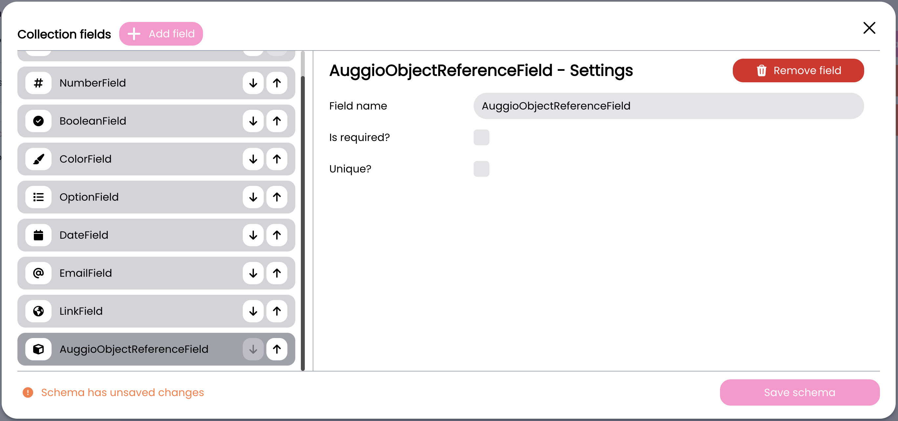

## **Working with Collection Items**

Once your schema is defined, you can start adding items to your collection:

1. Select your collection  
2. Click "New Item"  
3. Fill in the form according to your schema  
4. Click "Save" to store the item

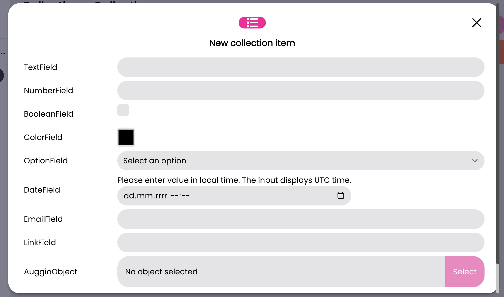

### **Editing Items**

To modify existing items:

1. Click on the row you want to edit in the collection view  
2. Update the values in the form  
3. Save your changes


## **Technical Integration**

### **Setting Up Collections in Unity**

To use collections in your Unity project:

1. Create an empty GameObject in your scene  
2. Add the CollectionsProvider component to the GameObject 

The CollectionsProvider has one important setting:

- Initialize On Awake: When enabled, collections will be initialized automatically when the scene starts.

### **Initializing Collections**

Collections can be initialized in two ways:

1. Automatic initialization if initializeOnAwake is set to true  
2. Manual initialization using the Initialize method:  

```csharp
CollectionsProvider.Instance.Initialize();
```

### **Handling Initialization Events**

Subscribe to initialization events to handle success, progress, and errors:

```csharp
CollectionsProvider.Instance.OnProviderInitialized += HandleInitialized;
CollectionsProvider.Instance.OnProviderInitializeError += HandleError;
CollectionsProvider.Instance.OnProviderInitializedProgress += HandleProgress;
```

### **Accessing Collection Data**

Once initialized, you can access collections and their data:

1. Get a collection by name:

```csharp
Collection myCollection;
if (CollectionsProvider.Instance.GetCollectionByName("collectionName", out myCollection)) {
    // Use myCollection
} 
```

2. Access collection rows:  
     
   - Get all rows: myCollection.Rows  
   - Get a specific row by ID: `myCollection.GetRowById("rowId")`


3. Access field values within a row:

```csharp
CollectionRow row = myCollection.GetRowById("rowId");
List<string> fieldValues = row.GetValueByFieldName("fieldName");
```

Note: Field values are stored as strings and should be converted to appropriate types based on the field's schema definition.

### **Authentication**

The SDK requires a file token for authentication:

- Download the token from [www.augg.io](https://www.augg.io) for your application  
- The token must be present in your project for collections to initialize

## **Best Practices**

### **Collection Naming**

- Use clear, descriptive names for collections  
  - Follow a consistent naming convention  
  - Consider grouping related collections with prefixes


### **Schema Design**

- Define required fields appropriately  
  - Use appropriate field types for data validation  
  - Consider data organization when designing schemas  
  - Keep schemas focused and avoid overly complex structures


### **Unity Integration**

- Initialize collections early in your application lifecycle  
  - Handle initialization errors gracefully  
  - Cache frequently accessed collection data  
  - Check if collections are initialized before accessing them  
  - Store Collection and CollectionRow references rather than looking them up repeatedly  
  - Consider caching GetValueByFieldName results if accessed frequently  
  - Handle missing or null values appropriately


### **Performance Optimization**

- Cache collection references when accessing the same collection multiple times  
  - Cache row references when working with specific rows frequently  
  - Consider storing converted values (e.g., parsed numbers) rather than converting strings repeatedly  
  - Use null checks when accessing rows and field values  
  - Handle initialization state properly to avoid unnecessary lookups


### **Error Handling**

- Always check if GetCollectionByName was successful before using the collection  
  - Verify row existence before accessing row data  
  - Implement appropriate error handling for missing or invalid field values  
  - Log errors appropriately for debugging purposes

## **Common Use Cases**

### **Managing Application Text Content**

Collections are particularly useful for managing text content in your application. Here's an example scenario:

1. Create a "TextContent" collection with fields:  
     
   - Key: Text field (required) - Identifier for the text content  
   - Content: Text field (required, text area) - The actual text content  
   - Category: Text field =- Optional grouping of related texts

2. Access text content in your Unity scripts:

```csharp
public class TextContentManager : MonoBehaviour
{
    private Collection textCollection;
    private Dictionary<string, string> textCache = new Dictionary<string, string>();
    
    private void Awake() {
        CollectionsProvider.Instance.OnProviderInitialized += HandleCollectionsInitialized;
    }
    
    private void OnDestroy() {
        if (CollectionsProvider.Instance != null) {
            CollectionsProvider.Instance.OnProviderInitialized -= HandleCollectionsInitialized;
        }
    }
       
    private void HandleCollectionsInitialized() {
        if (CollectionsProvider.Instance.GetCollectionByName("TextContent", out textCollection)) {
            CacheTexts();
        }
    }
       
    private void CacheTexts() {
        textCache.Clear();
        foreach (CollectionRow row in textCollection.Rows) {
            List<string> keyValues = row.GetValueByFieldName("Key");
            List<string> contentValues = row.GetValueByFieldName("Content");
            if (keyValues.Count > 0 && contentValues.Count > 0) {
                string key = keyValues[0];
                string content = contentValues[0];
                if (!string.IsNullOrEmpty(key) && !string.IsNullOrEmpty(content)) {
                    textCache[key] = content;
                }
            }
        }
    }
    
    public string GetText(string key, string defaultText = "") { 
        string text;
        if (textCache.TryGetValue(key, out text)) {
            return text;
        }
        return defaultText;
    }
}
```

3. Benefits of this approach:  
   - Content can be updated without code changes  
   - Content can be organized by categories  
   - Non-technical team members can edit text through the CMS  
   - Consistent text management across the application

